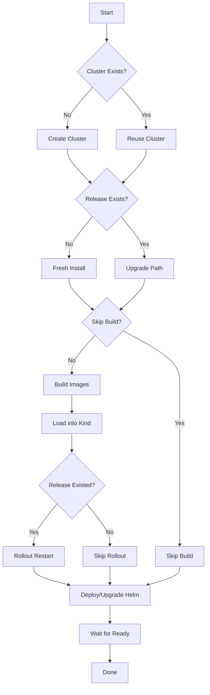

# E2E Iterative Development Guide

## Overview

The `run_kind_e2e.sh` script now supports **iterative development** - you can rebuild and redeploy images to an already-running cluster without tearing it down!

## How It Works

### First Run (Fresh Install)
When you run the script for the first time:
```bash
./tests/run_kind_e2e.sh
```

1. ✅ Creates Kind cluster
2. ✅ Builds all Docker images
3. ✅ Loads images into Kind
4. ✅ Deploys Helm chart (fresh install)
5. ✅ Waits for pods to be ready

### Subsequent Runs (Iterative Updates)
When you run the script again with the cluster already running:
```bash
./tests/run_kind_e2e.sh
```

1. ✅ Detects existing cluster (reuses it)
2. ✅ Detects existing deployment
3. ✅ Rebuilds all Docker images (with your latest code changes)
4. ✅ Loads new images into Kind
5. ✅ **Automatically rolls out new images** (kubectl rollout restart)
6. ✅ Upgrades Helm chart (if values changed)
7. ✅ Waits for rollout to complete

## Key Features

### Smart Detection
The script automatically detects:
- Whether a Kind cluster already exists
- Whether a Helm release is already deployed
- Adjusts behavior accordingly (install vs upgrade)

### Automatic Rollout
After rebuilding and loading images, the script:
- Triggers `kubectl rollout restart` for all deployments
- Waits for each deployment to complete its rollout
- Ensures zero-downtime updates

### Preserved State
When reusing a cluster:
- Persistent volumes are preserved
- ConfigMaps and Secrets remain intact
- Service endpoints stay the same
- Only the application pods are recreated with new images

## Usage Examples

### Standard Iterative Development
```bash
# First run - creates everything
./tests/run_kind_e2e.sh

# Make code changes to frontend/app.py, screenshot-api, etc.

# Second run - rebuilds and redeploys
./tests/run_kind_e2e.sh

# Repeat as needed...
```

### Skip Image Build (Test Config Changes Only)
```bash
# Only update Helm values without rebuilding images
SKIP_BUILD=true ./tests/run_kind_e2e.sh
```

### Force Fresh Install
```bash
# Delete cluster first, then run
kind delete cluster --name geosnap-e2e
./tests/run_kind_e2e.sh
```

### Build Specific Service Only
```bash
# Build and load only frontend
cd frontend
docker build -t geosnap/frontend:kind-e2e .
kind load docker-image geosnap/frontend:kind-e2e --name geosnap-e2e
kubectl rollout restart deployment frontend -n geosnap-e2e

# Or use the script to rebuild all
./tests/run_kind_e2e.sh
```

## Workflow Benefits

### 1. Fast Iteration Cycles
- No need to tear down and recreate the cluster
- Only rebuilds changed code
- Quick rollout (typically 10-30 seconds)

### 2. Preserved State
- Database/cache data persists
- Session state maintained
- Logs remain accessible

### 3. Real Kubernetes Environment
- Tests actual K8s behavior (not just docker-compose)
- Validates Helm charts
- Catches K8s-specific issues early

### 4. Easy Debugging
```bash
# Run the script to deploy
./tests/run_kind_e2e.sh

# Access frontend
kubectl port-forward -n geosnap-e2e svc/frontend 5000:5000

# Check logs
kubectl logs -n geosnap-e2e -l app=frontend --tail=50

# Make changes and redeploy
./tests/run_kind_e2e.sh
```

## Technical Details

### New Functions Added

#### `check_release_exists()`
```bash
check_release_exists() {
  if helm list -n "${NAMESPACE}" | grep -q "^${RELEASE_NAME}"; then
    return 0
  else
    return 1
  fi
}
```
Checks if the Helm release is already deployed.

#### `rollout_restart_deployments()`
```bash
rollout_restart_deployments() {
  # Gets all deployments from the release
  # Triggers kubectl rollout restart for each
  # Waits for all rollouts to complete
}
```
Automatically restarts deployments with new images.

### Execution Flow



### Image Pull Policy

The Helm values use `IfNotPresent`:
```yaml
image:
  pullPolicy: IfNotPresent
```

This means:
- Kubernetes will use cached images if available
- `rollout restart` forces pods to recreate
- New pods pull the updated images from Kind's cache
- Works because we're loading images directly into Kind

## Common Scenarios

### Scenario 1: Frontend Code Changes
```bash
# Edit frontend/app.py
vim frontend/app.py

# Rebuild and redeploy
./tests/run_kind_e2e.sh

# Check logs
kubectl logs -n geosnap-e2e -l app=frontend -f
```

### Scenario 2: Helm Chart Changes
```bash
# Edit charts/geosnappro/values.yaml
vim charts/geosnappro/values.yaml

# Deploy changes (skip build if no code changes)
SKIP_BUILD=true ./tests/run_kind_e2e.sh
```

### Scenario 3: Multiple Services Updated
```bash
# Edit multiple services
vim frontend/app.py
vim screenshot-api/app.py
vim gluetun-k8s/app.py

# Rebuild all and redeploy
./tests/run_kind_e2e.sh

# All three deployments will restart with new images
```

### Scenario 4: Fresh Start Needed
```bash
# Sometimes you need a clean slate
kind delete cluster --name geosnap-e2e
./tests/run_kind_e2e.sh
```

## Troubleshooting

### Issue: Rollout Stuck
```bash
# Check rollout status
kubectl rollout status deployment/frontend -n geosnap-e2e

# Check pod status
kubectl get pods -n geosnap-e2e

# Check pod logs
kubectl logs -n geosnap-e2e <pod-name>

# Manual rollback if needed
kubectl rollout undo deployment/frontend -n geosnap-e2e
```

### Issue: Image Not Updating
```bash
# Force delete pods to pull new image
kubectl delete pod -n geosnap-e2e -l app=frontend

# Or restart the deployment
kubectl rollout restart deployment/frontend -n geosnap-e2e

# Verify image in pod
kubectl describe pod -n geosnap-e2e <pod-name> | grep Image:
```

### Issue: Helm Values Not Applied
```bash
# Check current Helm values
helm get values geosnappro-e2e -n geosnap-e2e

# Force helm upgrade
helm upgrade geosnappro-e2e ./charts/geosnappro \
  -n geosnap-e2e \
  --reuse-values \
  --force
```

## Performance Tips

1. **Use SKIP_BUILD when possible**
   - If only changing Helm values, skip the build step
   - Saves 2-3 minutes per iteration

2. **Build specific images manually**
   - If only one service changed, build just that image
   - Faster than rebuilding all three

3. **Use incremental builds**
   - Docker layer caching speeds up builds
   - Only changed layers are rebuilt

4. **Keep cluster running**
   - Set `KEEP_CLUSTER=true` (default)
   - Avoid cluster creation overhead

## Environment Variables

All existing environment variables still work:

```bash
CLUSTER_NAME=my-test          # Custom cluster name
NAMESPACE=my-namespace        # Custom namespace
SKIP_BUILD=true              # Skip image building
SKIP_TESTS=true              # Skip pytest (default)
KEEP_CLUSTER=true            # Keep cluster after run (default)
IMAGE_TAG=my-tag             # Custom image tag
```

## Comparison: Before vs After

### Before (Manual Process)
```bash
# 1. Delete everything
kind delete cluster --name geosnap-e2e

# 2. Run full script (5-10 minutes)
./tests/run_kind_e2e.sh

# 3. Make changes
vim frontend/app.py

# 4. Repeat steps 1-2 (another 5-10 minutes)
```
**Total time per iteration: 10-20 minutes**

### After (Iterative Process)
```bash
# 1. Initial setup (once)
./tests/run_kind_e2e.sh

# 2. Make changes
vim frontend/app.py

# 3. Quick rebuild and redeploy (1-2 minutes)
./tests/run_kind_e2e.sh

# 4. Repeat steps 2-3
```
**Total time per iteration: 1-2 minutes** ⚡

## Best Practices

1. ✅ Keep the cluster running between iterations
2. ✅ Use the script for all deployments (maintains consistency)
3. ✅ Check pod logs after each deployment
4. ✅ Use port-forward to test changes immediately
5. ✅ Clean up occasionally with `kind delete cluster`
6. ✅ Commit working changes before major refactors

## Related Documentation

- [K8S_POD_ERRORS_FIXED.md](../K8S_POD_ERRORS_FIXED.md) - Recent fixes applied
- [GLUETUN_SERVER_CONFIGURATION.md](GLUETUN_SERVER_CONFIGURATION.md) - Server config guide
- [tests/run_kind_e2e.sh](../tests/run_kind_e2e.sh) - The updated script

---

**Status**: ✅ Fully Functional  
**Updated**: November 18, 2025  
**Script Version**: Enhanced with iterative deployment support

